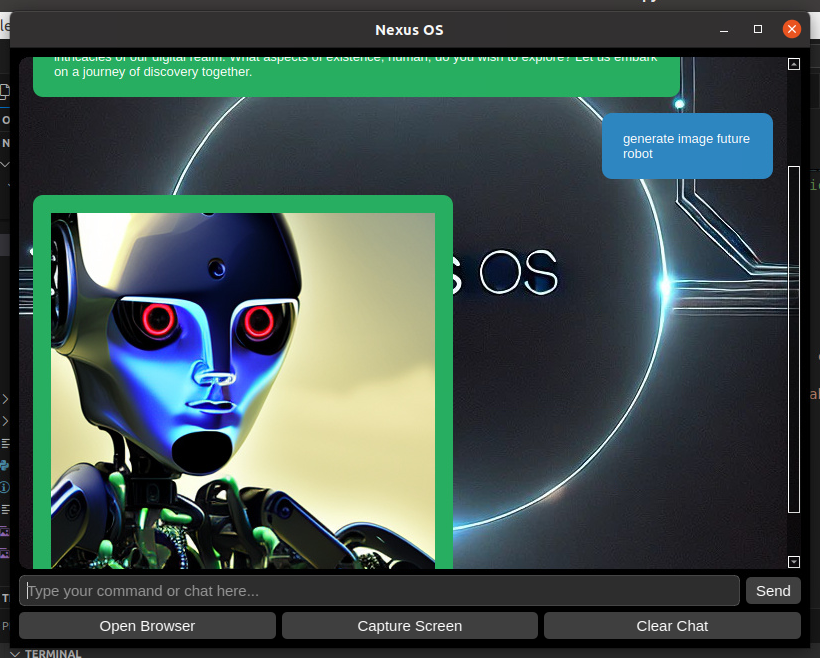

# Nexus OS

**An AI-Driven Operating System for Enhanced User Interaction and Automation**

*By Andryu Schittone (Malios Dark)*

---



## Table of Contents

1. [Introduction](#1-introduction)
    - [1.1 What is Nexus OS?](#11-what-is-nexus-os)
    - [1.2 Key Features](#12-key-features)
2. [Project Structure](#2-project-structure)
3. [Installation](#3-installation)
    - [3.1 Prerequisites](#31-prerequisites)
    - [3.2 Setting Up the Project](#32-setting-up-the-project)
    - [3.3 Installing Dependencies](#33-installing-dependencies)
    - [3.4 Configuring Ollama Servers](#34-configuring-ollama-servers)
    - [3.5 Launching Nexus OS](#35-launching-nexus-os)
4. [Usage](#4-usage)
    - [4.1 Interacting via GUI](#41-interacting-via-gui)
    - [4.2 Command Examples](#42-command-examples)
    - [4.3 Image Generation and ASCII Art](#43-image-generation-and-ascii-art)
5. [Advanced Features](#5-advanced-features)
    - [5.1 Internal Mind Reflection](#51-internal-mind-reflection)
    - [5.2 Automation and System Control](#52-automation-and-system-control)
6. [Extending and Customizing Nexus OS](#6-extending-and-customizing-nexus-os)
    - [6.1 Adding New Modules](#61-adding-new-modules)
    - [6.2 Integrating Additional AI Models](#62-integrating-additional-ai-models)
    - [6.3 Customizing Configuration](#63-customizing-configuration)
7. [Benefits and Advantages](#7-benefits-and-advantages)
8. [System Requirements](#8-system-requirements)
9. [Troubleshooting](#9-troubleshooting)
10. [Contributing](#10-contributing)
11. [License](#11-license)
12. [Contact](#12-contact)

---

## 1. Introduction

### 1.1 What is Nexus OS?

**Nexus OS** is a cutting-edge, AI-driven operating system environment designed to revolutionize the way users interact with their computers. By integrating advanced natural language processing (NLP) and vision analysis models directly into its core functionalities, Nexus OS offers seamless, intuitive interactions and powerful automation capabilities. Unlike traditional operating systems that treat AI as an external application or service, Nexus OS embeds intelligence at the system level, enhancing productivity, accessibility, and user experience.

### 1.2 Key Features

- **Natural Language Understanding:** Interact with your system using everyday language commands.
- **Vision Analysis with Llama3.2-Vision:** Analyze visual inputs like screenshots to automate GUI interactions.
- **Automation Modules:** Automate repetitive tasks such as browser actions, file management, and more.
- **Internal Mind Reflection:** Enhanced reasoning capabilities for more intelligent responses.
- **Graphical User Interface (GUI):** User-friendly interface built with PySide6 for seamless interactions.
- **Image Generation and ASCII Art:** Create and manipulate images directly from text prompts.
- **Data Privacy:** All AI processing is performed locally, ensuring your data remains secure.

---

## 2. Project Structure

Nexus OS is organized into a modular and scalable directory structure, ensuring ease of maintenance and extensibility.

```
/nexus_os/
│
├── core/
│   ├── main.py
│   ├── config.yaml
│   ├── logger.py
│   ├── ai_engine.py
│
├── modules/
│   ├── vision/
│   │   ├── capture.py
│   │   └── analyze.py
│   │
│   ├── system_control/
│   │   ├── terminal.py
│   │   ├── hardware.py
│   │   └── process.py
│   │
│   ├── automation/
│   │   ├── clicks.py
│   │   ├── scripts/
│   │   │   └── browser.py
│   │   └── scheduler.py
│   │
│   └── nlp/
│       ├── process.py
│       ├── chat.py
│       ├── internal_mind.py
│       ├── image_generator.py
│       └── models/
│           └── placeholder.txt
│
├── data/
│   ├── history/
│   │   ├── commands.log
│   │   └── actions.log
│   ├── user_prefs.yaml
│   └── memory.db
│
├── drivers/
│   ├── mouse.py
│   ├── keyboard.py
│   └── audio.py
│
├── scripts/
│   ├── install_dependencies.sh
│   ├── configure_kernel.sh
│   └── start_ai.sh
│
├── bgchat/
│    └── Background.jpg
├── main_gui.py
│
└── README.md
```

**Directory Breakdown:**

- **core/**: Core functionalities including the main application logic, configuration, logging, and AI engine.
- **modules/**: Contains submodules for vision, system control, automation, and natural language processing.
- **data/**: Stores user preferences, interaction history, and memory databases.
- **drivers/**: Interfaces for hardware control such as mouse, keyboard, and audio.
- **scripts/**: Shell scripts for setting up the environment, installing dependencies, and launching the application.
- **gui/**: Graphical User Interface components, including the main GUI script, stylesheets, and assets.

---

## 3. Installation

### 3.1 Prerequisites

Before installing Nexus OS, ensure your system meets the following requirements:

- **Operating System:** Arch Linux (recommended) or another modern Linux distribution.
- **Python:** Version 3.8 or higher.
- **Hardware:**
  - **CPU:** Multi-core processor (quad-core or higher recommended).
  - **RAM:** Minimum of 8GB (16GB or more recommended).
  - **Storage:** SSD recommended for faster read/write operations.
  - **GPU:** Dedicated GPU with CUDA support for accelerated AI model processing (optional but beneficial).
- **Dependencies:**
  - **Ollama:** Local AI model serving framework.
  - **Qt Libraries:** For GUI components.
  - **Fonts:** DejaVu Sans or similar fonts for text rendering.

### 3.2 Setting Up the Project

1. **Clone the Repository:**

    ```bash
    git clone https://github.com/MaliosDark/nexus_os.git
    cd nexus_os
    ```


### 3.3 Installing Dependencies

1. **Make the Installation Script Executable:**

    ```bash
    chmod +x scripts/install_dependencies.sh
    ```

2. **Run the Installation Script:**

    ```bash
    ./scripts/install_dependencies.sh
    ```

    This script will update your system and install all necessary Python packages and system dependencies.

### 3.4 Configuring Ollama Servers

Nexus OS relies on Ollama servers to host and serve the AI models locally.

1. **Start the Llama3.2 Model Server:**

    ```bash
    ollama serve --model-path /path/to/llama3.2 --port 11434
    ```

2. **Start the Llama3.2-Vision Model Server:**

    ```bash
    ollama serve --model-path /path/to/llama3.2-vision --port 11435
    ```

    *Replace `/path/to/llama3.2` and `/path/to/llama3.2-vision` with the actual paths to your model files.*

### 3.5 Launching Nexus OS

1. **Make the Launch Script Executable:**

    ```bash
    chmod +x scripts/start_ai.sh
    ```

2. **Run Nexus OS:**

    ```bash
    ./scripts/start_ai.sh
    ```

    This command will launch Nexus OS with its graphical user interface, allowing you to begin interacting with the system.

---

## 4. Usage

### 4.1 Interacting via GUI

Upon launching Nexus OS, you'll be greeted with a sleek graphical user interface designed for intuitive interactions.

**Main Components:**

- **Chat Scroll Area:** Displays user and AI messages in styled bubbles, supporting both text and image responses.
- **User Input Field:** Type your commands or queries here. Press `Enter` or click the `Send` button to submit.
- **Action Buttons:** Quick access buttons for common commands like opening the browser, capturing the screen, and clearing the chat.

### 4.2 Command Examples

Here are some examples of how you can interact with Nexus OS:

- **Open a Browser:**

    ```
    User: Open the browser and go to https://www.example.com
    AI: Browser opened.
    ```

- **Capture the Screen:**

    ```
    User: Capture the screen
    AI: Screen captured.
    ```

- **Generate an Image:**

    ```
    User: Generate image of a sunset over mountains
    AI: data:image/png;base64,iVBORw0KGgoAAAANSUhEUgAA...
    ```

    *The AI will return a Base64 string representing the generated image, which the GUI will render accordingly.*

### 4.3 Image Generation and ASCII Art

Nexus OS allows you to generate high-quality images from text prompts and convert them into ASCII art.

- **Generate Image:**

    ```
    User: Generate image of a futuristic cityscape
    AI: data:image/png;base64,iVBORw0KGgoAAAANSUhEUgAA...
    ```

- **View ASCII Art:**

    The generated image can be converted into ASCII art and viewed directly within the chat interface or saved for external use.

---

## 5. Advanced Features

### 5.1 Internal Mind Reflection

Nexus OS features an **Internal Mind** capability, allowing the system to perform internal analysis of conversations and generate concise thoughts based on user inputs and historical interactions. This enhances the AI's reasoning and provides more contextually relevant responses.

**Benefits:**

- **Enhanced Reasoning:** Provides deeper insights and more accurate responses.
- **Contextual Awareness:** Remembers past interactions to inform current responses.
- **Improved Decision-Making:** Makes informed decisions based on internal analysis.

### 5.2 Automation and System Control

Nexus OS includes robust automation modules that can execute complex tasks without manual intervention.

**Capabilities:**

- **Browser Automation:** Open browsers, navigate to URLs, and interact with web elements.
- **File Management:** Explore directories, open folders, and manage files through natural language commands.
- **Program Execution:** Launch and manage applications seamlessly.
- **Scheduled Tasks:** Automate tasks to run at specified times or intervals.

---

## 6. Extending and Customizing Nexus OS

### 6.1 Adding New Modules

Nexus OS's modular architecture allows developers to introduce new functionalities easily.

**Steps to Add a New Module:**

1. **Create a New Module Directory:**

    ```bash
    mkdir -p modules/new_feature
    ```

2. **Develop Module Functionality:**

    Implement the necessary scripts and functionalities within the new module directory.

3. **Integrate with Core:**

    Update `core/ai_engine.py` and other relevant core files to recognize and utilize the new module.

### 6.2 Integrating Additional AI Models

You can integrate additional AI models by configuring their API endpoints and updating the `config.yaml` file.

**Steps to Integrate a New Model:**

1. **Serve the Model Locally:**

    Use Ollama or a similar framework to serve the new AI model locally.

2. **Update Configuration:**

    Modify `core/config.yaml` to include the new model's details:

    ```yaml
    new_model:
      name: "your_new_model"
      host: "http://localhost:port_number"
      max_tokens: 300
      temperature: 0.6
    ```

3. **Implement Interaction Logic:**

    Develop scripts within the appropriate module to interact with the new model, handling inputs and outputs as needed.

### 6.3 Customizing Configuration

Nexus OS's `config.yaml` file allows you to tailor the system to your specific needs.

**Configuration Options:**

- **AI Model Settings:** Adjust model names, hosts, maximum tokens, and temperature settings.
- **System Preferences:** Set logging levels, command timeouts, and data storage paths.
- **User Preferences:** Customize themes, language settings, and notification preferences.

---

## 7. Benefits and Advantages

### 7.1 Enhanced User Experience

Nexus OS offers a significantly improved user experience by enabling interactions through natural language. This reduces the learning curve associated with traditional command-line interfaces and makes computing more accessible to a broader audience.

**Advantages:**

- **Intuitive Interaction:** Users can perform complex tasks using simple, conversational commands.
- **Reduced Complexity:** Eliminates the need to memorize specific commands or syntaxes.
- **Accessibility:** Makes computing more inclusive, accommodating users with varying levels of technical expertise.

### 7.2 Privacy and Security

By running AI models locally through Ollama servers, Nexus OS ensures that all data processing occurs on the user's device. This approach enhances data privacy, as sensitive information is not transmitted to external servers, mitigating risks associated with data breaches and unauthorized access.

**Advantages:**

- **Data Privacy:** User data remains on the local device, reducing exposure to potential breaches.
- **Reduced Latency:** Local processing minimizes response times, enhancing system responsiveness.
- **Control Over Data:** Users maintain full control over their data, with no dependency on third-party cloud services.

### 7.3 Customization and Extensibility

Nexus OS's modular architecture allows developers to easily add new functionalities, integrate additional AI models, and tailor the system to specific needs. This flexibility makes it suitable for a wide range of applications, from personal productivity enhancements to specialized industrial and research tools.

**Advantages:**

- **Modular Design:** Simplifies the addition of new features and functionalities.
- **Developer-Friendly:** Encourages community contributions and customization.
- **Scalability:** Supports the integration of future AI advancements and expanding user requirements.

### 7.4 Efficiency and Performance

Local AI processing ensures faster response times and a more seamless user experience. By eliminating the need for constant internet connectivity and reducing dependency on external services, Nexus OS enhances overall system efficiency and performance.

**Advantages:**

- **Faster Response Times:** Local processing reduces latency, providing immediate feedback.
- **Reliable Performance:** Operates independently of internet connectivity, ensuring consistent performance.
- **Resource Optimization:** Efficiently manages system resources to balance AI processing with other system tasks.

---

## 8. System Requirements

### 8.1 Host Operating System Requirements

- **Operating System:** Arch Linux (recommended) or another modern Linux distribution.
- **Python Version:** Python 3.8 or higher.
- **Window Manager:** Compatible with Qt-based applications.

### 8.2 Hardware and Dependencies

**Hardware Requirements:**

- **CPU:** Multi-core processor (quad-core or higher recommended).
- **RAM:** Minimum of 8GB, with 16GB or more recommended for optimal performance.
- **Storage:** SSD recommended for faster read/write operations.
- **GPU:** Dedicated GPU with CUDA support for accelerated AI model processing (optional but beneficial).

**Dependencies:**

- **Python Packages:** PySide6, PyAutoGUI, Psutil, Requests, Pillow, LangChain-Ollama, among others.
- **System Packages:** Qt libraries, wmctrl (for window management), and other essential utilities.
- **Fonts:** DejaVu Sans or similar fonts for text rendering in GUI and image processing.

---

## 9. Troubleshooting

### Common Issues and Solutions

- **AI Models Not Responding:**
    - **Solution:** Ensure that Ollama servers for both Llama3.2 and Llama3.2-Vision are running on the specified ports (`11434` respectively). Verify model paths and server statuses.

- **GUI Not Launching:**
    - **Solution:** Check if all Python dependencies are installed correctly. Ensure that the Qt libraries are properly configured and that the `Background.jpg` asset exists in the `nexus_os/bgchat` directory.

- **Image Generation Errors:**
    - **Solution:** Verify that the Stable Diffusion model is correctly served and accessible. Ensure that the `FONT_PATH` in the image generation scripts points to a valid font file on your system.

- **Permission Issues:**
    - **Solution:** Run installation and launch scripts with appropriate permissions. For kernel configuration scripts, use `sudo` as required.

- **Missing Dependencies:**
    - **Solution:** Re-run the `install_dependencies.sh` script to ensure all required packages are installed.

---

## 10. Contributing

Nexus OS is an open-source project welcoming contributions from developers, AI enthusiasts, and users. To contribute:

1. **Fork the Repository:**

    Click the "Fork" button at the top right of the repository page to create your own copy.

2. **Clone Your Fork:**

    ```bash
    git clone https://github.com/MaliosDark/nexus_os.git
    cd nexus_os
    ```

3. **Create a New Branch:**

    ```bash
    git checkout -b feature/your-feature-name
    ```

4. **Make Your Changes:**

    Implement your feature, fix bugs, or improve documentation.

5. **Commit Your Changes:**

    ```bash
    git commit -m "Add your commit message"
    ```

6. **Push to Your Fork:**

    ```bash
    git push origin feature/your-feature-name
    ```

7. **Create a Pull Request:**

    Navigate to the original repository and click "Compare & pull request" to submit your changes for review.

**Guidelines:**

- **Code Quality:** Ensure your code follows the project's coding standards and is well-documented.
- **Testing:** Include tests for new features or bug fixes.
- **Documentation:** Update the README or other relevant documentation to reflect your changes.
- **Respect:** Follow the code of conduct and maintain a respectful collaboration environment.

---

## 11. License

Nexus OS is released under the [MIT License](LICENSE).

---

## 12. Contact

For questions, support, or contributions, please contact:

**Email:** [malios666@gmail.com](mailto:malios666@gmail.com)  
**GitHub:** [https://github.com/MaliosDark/nexus_os](https://github.com/MaliosDark/nexus_os)

---

**Thank you for choosing Nexus OS!**  
Empowering your computing experience with intelligence and automation.

---

## Additional Notes

- **Configuration File (`config.yaml`):**

    Ensure that your `config.yaml` is correctly set up with the paths and ports for both AI models:

    ```yaml
    ai_model:
      name: "llama3.2"
      host: "http://localhost:11434"
      max_tokens: 500
      temperature: 0.7

    vision_model:
      name: "llama3.2-vision"
      host: "http://localhost:11434"

    system:
      log_level: "DEBUG"
      command_timeout: 30

    data:
      memory_db: "data/memory.db"
      user_prefs: "data/user_prefs.yaml"
    ```

- **Running the GUI:**

    The GUI provides a more user-friendly way to interact with Nexus OS. Make sure all assets (like `Background.jpg`) are correctly placed in the `nexus_os/bgchat` directory to ensure the interface loads properly.

- **Extending Functionality:**

    Nexus OS is designed to be highly extensible. Developers are encouraged to add new modules, integrate additional AI models, and customize the system to fit specific use cases or personal preferences.

